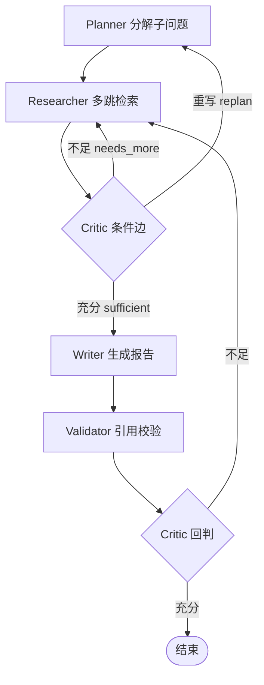

# 深度研究 Agent 怎么做成「可控」的 agentic loop？LangGraph 架构 + Critic 节点化 5 个踩坑

> 太长不看：把「深度研究」做成循环不难，难的是**不让它跑飞**。我们用 LangGraph 把循环显式建模成图，把「信息够不够」抽成独立的 Critic 节点，再用**硬闸（纯函数）压在 LLM 之上**做失控防火墙。
> 仓库：https://github.com/TianJinYing2006/DeepResearch

---

你有没有遇到过这种场景：让 Agent 去「对比 Transformer 和 Mamba 在长序列下的 FLOPs 复杂度」，它检索一轮就开写，写出来的报告要么信息不足靠编，要么检索太多把上下文撑爆。

问题不在「能不能搜」，而在「**搜到什么程度算够**」。本文复盘我们用 LangGraph 做 DeepResearch 时，怎么把这件事做成**可控的 agentic loop**，以及踩过的 5 个坑。

---

## 一、为什么不是一次 RAG

深度研究类任务有一个绕不开的特征：**你事先不知道要检索几轮、问几个子问题**。

单次 RAG 检索一轮就写报告，要么信息不足靠模型编，要么检索太多把上下文撑爆。真正的瓶颈是「搜到什么程度算够」，所以核心抽象必须是一个**带反思（reflection）的循环**：

```
规划子问题 → 多跳检索 → 判断是否充分 → 不充分就带新线索再搜 → 充分了才写报告
```

这个循环如果用一堆 `while`+`if` 硬编码，三五个分支后就变成无法维护的状态机。我们用 LangGraph 把它显式建模成图。

---

## 二、LangGraph 状态机：节点纯函数 + Pydantic 状态

整张图两条约束：

1. **节点是纯函数**：入参 `ResearchState`，出参是一个 patch dict，不直接改全局。
2. **状态是 Pydantic `ResearchState`**：跨节点数据都走它，类型可校验。

6 个节点 + 一个 Critic 条件边，形成 2 个回环：



**反直觉设计：`findings`（检索到的证据）故意不加 reducer。**

普通 LangGraph 里 list 字段通常配 `add_messages` 这类 reducer 自动合并。我们刻意不加——因为 `findings` 必须保持引用契约：每条 finding 的编号、来源、置信度在整条链路上稳定不变，下游引用 `[来源:3]` 才不会因合并顺序错位而指错。代价是并发写时要自己做 `visited_sources` 去重。

---

## 三、Critic 节点化：把「够不够」交给 LLM 路由

最值钱的设计决策是 **Critic 节点化**——把「当前信息是否充分」从硬编码规则里抽出来，做成独立 LLM 节点，再用 `conditional_edge` 路由。

Critic 返回结构化裁决：

```python
class CriticVerdict(BaseModel):
    sufficient: bool                 # 必填，漏字段走纠错重试而非静默默认
    next_queries: List[str] = []    # 不足时追回 frontier 的新查询
    reason: str = ""
```

三态路由：

- **sufficient** → 进入 Writer / 结束
- **needs_more** → `next_queries` 追回全局 `frontier`，Researcher 带新线索再检索（回环 1）
- **replan** → 回 Planner 重分解（`max_replan=1` 兜底，防无限重规划）

把 Critic 做成节点而非内联函数，路由逻辑对 LLM 可见、可观测、可单测，后面接 Langfuse 时每一跳裁决都能在 trace 里看到。

---

## 四、5 个踩坑（重点）

**坑 1：硬闸必须优先于 LLM，路由只能是纯函数**
曾让 Critic 在「判断充分」同时决定「要不要继续」，结果 LLM 永远说「还不够」，循环跑飞、成本爆炸。修正：Critic 之前先过**硬闸（纯函数、零 LLM）**——`depth/frontier/replan/token` 四道闸，任一触发直接终止，LLM 的 `sufficient` 只在未触发时才生效。**路由是纯函数，模型只能给建议，不能绕过硬闸。** 这是 agentic loop 不失控的底线。

**坑 2：max_total_hops=20 防总体失控，每子问题 5 跳防饿死**
只锁总跳数不够：某子问题被反复检索会占满总预算、饿死其他子问题。于是加**每子问题跳数上限 = 5**，单点卡住就割肉，保整体覆盖。

**坑 3：token 要回传 state 才能进硬闸**
硬闸要判断 token 是否超限，但 token 是 LLM 调用时才产生。最初 `LLMClient` 是薄封装、没回写 `state`——硬闸拿不到数。修正：`chat(..., state=state)` 同时做「调用 + 把 token 累计进 `state.token_used`」，并让 `router` 回传 usage。这也直接否决了「迁到 LangChain Runnable」——Runnable 没有这个约定。

**坑 4：revise 追回 frontier 要有兜底**
Critic 返回的 `next_queries` 经 `Send` 进全局 `frontier` 并行检索。但 Critic 偶尔返回空/重复 query，导致「看似在循环实则没进展」。修正：B 分支 `max_replan=1` 兜底 + `frontier` 去重。

**坑 5：findings 不加 reducer，并发去重要自己做**
Researcher 用 `Send` 把多子查询**并行**推给 W2（有限并发）时，多分支同时产出 `findings`，必须靠 `visited_sources` 去重，否则同一来源写两遍、引用编号错乱。

---

## 五、eval 数字给的启示

20 条数据集 + 7 指标评测，有个扎心数字：**任务完成率 100%，但引用覆盖度只有 55%。**

翻译：系统「能写完报告」，但近一半该查的没查到。瓶颈不在「写」而在「查」——Critic 充分度判据对「覆盖度」信号不敏感，容易过早说「够了」。**硬闸管住不失控，但充分度本身要靠 Critic 接入覆盖度信号才能再上一层。**

---

## 六、小结

把深度研究做成 agentic loop，难的不在调通 LangGraph，而在：

1. 节点纯函数 + 状态契约，让图可被单测锁死收敛；
2. Critic 节点化，把「够不够」显式化、可观测；
3. 硬闸优先于 LLM，纯函数路由是失控防火墙；
4. 覆盖度信号才是 Critic 充分度判据的下一个进化方向。

仓库已开源（MIT），含完整 W1~W6 设计评审与 eval 报告：
- GitHub（权威源）：https://github.com/TianJinYing2006/DeepResearch
- Gitee 镜像：https://gitee.com/tian-jinying/DeepResearch

下一篇预告：用 Langfuse 给这套图做全链路 trace（7 节点 span + 每次 LLM 调用的 token/cost）。
