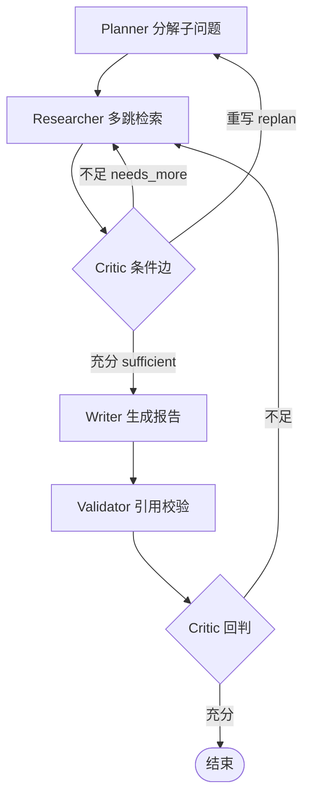

# 用 LangGraph 把「深度研究」做成可控的 agentic loop：架构设计与 Critic 节点化踩坑

> 仓库：https://github.com/TianJinYing2006/DeepResearch
> 本文是 DeepResearch 开源后的第一篇技术复盘，只讲架构与踩坑，不堆术语。

---

## 一、为什么不是「一次 RAG」

深度研究类任务（比如「对比 Transformer 与 Mamba 在长序列下的 FLOPs 复杂度」）有一个绕不开的特征：**你事先不知道要检索几轮、问几个子问题**。

单次 RAG 的问题是：检索一轮就写报告，要么信息不足靠模型编，要么检索太多把上下文撑爆。真正的瓶颈不是「能不能搜」，而是「搜到什么程度算够」。

所以核心抽象必须是一个 **带反思（reflection）的循环**：

```
规划子问题 → 多跳检索 → 判断是否充分 → 不充分就带着新线索再搜 → 充分了才写报告
```

这个循环如果用一堆 `while` + `if` 硬编码，三五个分支后就会变成无法维护的状态机。于是我们用 LangGraph 把它显式建模成图。

---

## 二、LangGraph 状态机：节点纯函数 + Pydantic 状态

整个系统是一张 `StateGraph`，关键约束有两条：

1. **节点是纯函数**：入参是 `ResearchState`，出参是一个 patch dict，不直接改全局。
2. **状态是 Pydantic `ResearchState`**：所有跨节点数据都走它，类型可校验。

图里有 6 个节点 + 一个 Critic 条件边，形成 2 个回环：



注意一个反直觉的设计：**`findings`（检索到的证据）故意不加 reducer**。

普通 LangGraph 里 list 字段通常配 `add_messages` 这类 reducer 做自动合并。但我们刻意不加——因为 `findings` 必须保持 **ADR-0004 引用契约**（每条 finding 的编号、来源、置信度在整条链路上稳定不变，下游引用 `[来源:3]` 才不会因为合并顺序错位而指错）。代价是并发写 `findings` 时要自己做好 `visited_sources` 去重，不能靠框架兜底。

---

## 三、Critic 节点化：把「够不够」交给 LLM 路由

最值钱的设计决策是 **Critic 节点化**——把「当前信息是否充分」这一判断，从硬编码规则里抽出来，做成一个独立的 LLM 节点，再用 `conditional_edge` 路由。

Critic 不是简单返回 True/False，而是返回一个结构化裁决：

```python
class CriticVerdict(BaseModel):
    sufficient: bool                 # 必填，漏字段走纠错重试而非静默默认
    next_queries: List[str] = []    # 不足时，要追回 frontier 的新查询
    reason: str = ""
```

`conditional_edge` 根据 `sufficient` 三态路由：

- **sufficient** → 进入 Writer / 结束
- **needs_more** → `next_queries` 被追回全局 `frontier` 队列，Researcher 带着新线索再检索（这就是回环 1）
- **replan** → 回到 Planner 重新分解（用 `max_replan=1` 兜底，防止无限重规划）

把 Critic 做成节点而不是函数内联，好处是：**路由逻辑对 LLM 可见、可观测、可单测**，后面接 Langfuse 时每一跳的裁决都能在 trace 里看到。

---

## 四、踩坑实录（最该看的 section）

### 坑 1：硬闸必须优先于 LLM，路由只能是纯函数

一开始我们让 Critic 在「判断充分」的同时也能决定「要不要继续」。问题来了：LLM 可能永远说「还不够」，循环跑飞，token 成本爆炸。

**修正**：在 Critic 之前先过一层 **硬闸（纯函数、零 LLM 调用）**——`depth / frontier / replan / token` 四道闸，任何一道触发直接终止循环，LLM 的 `sufficient` 只在不触发硬闸时才生效。**路由是纯函数，模型只能给「建议」，不能绕过硬闸。** 这是 agentic loop 不失控的底线。

### 坑 2：max_total_hops=20 防总体失控，每子问题 5 跳防饿死

硬闸里最容易被忽略的是「总体预算」。我们设 `max_total_hops=20`，等价于「旧设计的 max_depth × max_subquestions」，从总量上锁死循环次数。

但只锁总量不够：如果某个子问题被反复检索，会占满总跳数、饿死其他子问题。于是又加了 **每子问题跳数上限 = 5**，单点卡住就割肉，保证整体覆盖。

### 坑 3：token 要回传 state 才能进硬闸

硬闸要判断 `token` 是否超限，但 token 是 LLM 调用时才产生的。最初的 `LLMClient` 是薄封装，token 没回写 `state`——硬闸拿不到数。

**修正**：`client.py` 的 `chat(..., state=state)` 一个参数同时做「调用 + 把 token 累计进 `state.token_used`」，并让 `router.py` 回传 usage。这直接否决了「迁到 LangChain Runnable」的念头——Runnable 接口没有这个约定，迁过去反而要再包一层。

### 坑 4：revise 追回 frontier 要有兜底

Critic 返回 `next_queries` 时，这些查询会 `Send` 进全局 `frontier` 队列并行检索。但 Critic 偶尔会返回空 query 或重复 query，导致「看似在循环实则没进展」。

**修正**：B 分支用 `max_replan=1` 兜底——连续重规划超过 1 次就强制收口；同时对 `frontier` 做去重，避免同一查询反复进队。

### 坑 5：findings 不加 reducer，并发去重要自己做

前面提过 `findings` 故意无 reducer。当 Researcher 用 `Send` 把多个子查询 **并行**推给 W2（有限并发，非 asyncio）时，多个分支会同时产出 `findings`，必须靠 `visited_sources` 去重，否则同一来源会被写两遍、引用编号错乱。

---

## 五、eval 数字给的设计启示

我们建了 20 条数据集 + 7 指标做受控评测，有个数字很扎心：

- **任务完成率 100%**，但 **引用覆盖度只有 55%**。

翻译一下：系统「能写完报告」，但近一半该查的没查到。这说明瓶颈不在「写」而在「查」——Critic 的充分度判据对「覆盖度」信号不敏感，容易过早说「够了」。

这反过来印证了坑 1 的设计：**硬闸管住不失控，但充分度本身要靠 Critic 接入「覆盖度」信号才能再上一层**。这是下一步的明确优化点，而不是堆更多工具。

---

## 六、小结

把深度研究做成 agentic loop，真正难的不在「调通 LangGraph」，而在于：

1. **节点纯函数 + 状态契约**，让图可被单测锁死收敛；
2. **Critic 节点化**，把「够不够」显式化、可观测；
3. **硬闸优先于 LLM**，纯函数路由是失控防火墙；
4. **覆盖度信号**才是 Critic 充分度判据的下一个进化方向。

仓库已开源（MIT），含完整 W1~W6 设计评审记录与 eval 报告：
- GitHub（权威源）：https://github.com/TianJinYing2006/DeepResearch
- Gitee 镜像：https://gitee.com/tian-jinying/DeepResearch

下一篇预告：用 Langfuse 给这套图做全链路 trace（7 节点 span + 每次 LLM 调用的 token/cost）。
